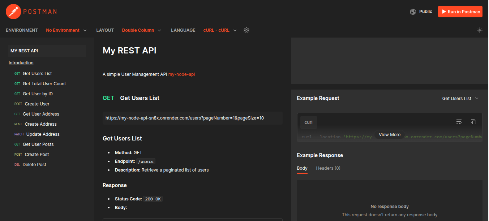

# User Management System API

A complete RESTful API for managing users, addresses, and posts built with Node.js, TypeScript, and SQLite.

[](https://documenter.getpostman.com/view/32091073/2sAYdkGouk)

## Features

- User management (create, retrieve, count)
- Address management (create, retrieve, update)
- Post management (create, retrieve, delete)
- RESTful API design
- Pagination support
- Input validation
- Error handling
- Graceful shutdown
- Unit tests

## Tech Stack

- **Backend**: Node.js, Express.js, TypeScript
- **Database**: SQLite
- **ORM**: Knex.js
- **Testing**: Jest, Supertest
- **Validation**: Express-validator
- **Other**: CORS, Helmet, Morgan

## API Endpoints

### User Endpoints
- `GET /users?pageNumber=0&pageSize=10` - Returns a paginated list of users
- `GET /users/count` - Returns the total number of users
- `GET /users/{id}` - Returns details of a specific user, including their address
- `POST /users` - Creates a new user

### Address Endpoints
- `GET /addresses/{userID}` - Returns the address associated with a user
- `POST /addresses` - Creates an address for a user
- `PATCH /addresses/{userID}` - Modifies the address associated with a user

### Post Endpoints
- `GET /posts?userId={userId}` - Returns all posts for a specific user
- `POST /posts` - Creates a new post for a user
- `DELETE /posts/{id}` - Deletes a post by its ID

## Installation and Setup

### Prerequisites
- Node.js (v14 or higher)
- npm or yarn

### Installation

1. Clone the repository
```bash
git clone https://github.com/Bsakwa/roqqu-backend
cd roqqu-backend
```

2. Install dependencies
```bash
npm install
```

3. Create a `.env` file in the root directory (optional)
```
PORT=3000
NODE_ENV=development
```

4. Run database migrations and seed data
```bash
npm run migrate
npm run seed
```

5. Build the TypeScript code
```bash
npm run build
```

### Running the API

#### Development mode
```bash
npm run dev
```

#### Production mode
```bash
npm run build
npm start
```

### Running Tests
```bash
npm run test
```

## Project Structure

```
user-management-system/
├── src/
│   ├── config/        # Configuration files
│   ├── controllers/   # Route controllers
│   ├── db/            # Database related files
│   │   ├── migrations/  # Database migrations
│   │   └── seeds/       # Seed data
│   ├── middleware/    # Custom middleware
│   ├── models/        # Data models
│   ├── routes/        # API routes
│   ├── utils/         # Utility functions
│   ├── app.ts         # Express app setup
│   └── server.ts      # Server entry point
├── tests/             # Test files
├── .env               # Environment variables
├── knexfile.ts        # Knex configuration
├── package.json       # Project dependencies
├── tsconfig.json      # TypeScript configuration
└── README.md          # Project documentation
```

## API Documentation

### User Endpoints

#### GET /users
Returns a paginated list of users.

Query Parameters:
- `pageNumber` (optional): Page number (default: 0)
- `pageSize` (optional): Items per page (default: 10)

Response:
```json
[
  {
    "id": 1,
    "username": "johndoe",
    "email": "john@example.com",
    "fullName": "John Doe",
    "createdAt": "2024-03-03T12:00:00.000Z",
    "updatedAt": "2024-03-03T12:00:00.000Z"
  },
  ...
]
```

#### GET /users/count
Returns the total number of users.

Response:
```json
{
  "count": 42
}
```

#### GET /users/{id}
Returns details of a specific user, including their address.

Response:
```json
{
  "id": 1,
  "username": "johndoe",
  "email": "john@example.com",
  "fullName": "John Doe",
  "createdAt": "2024-03-03T12:00:00.000Z",
  "updatedAt": "2024-03-03T12:00:00.000Z",
  "address": {
    "id": 1,
    "userId": 1,
    "street": "123 Main St",
    "city": "New York",
    "state": "NY",
    "country": "USA",
    "zipCode": "10001",
    "createdAt": "2024-03-03T12:00:00.000Z",
    "updatedAt": "2024-03-03T12:00:00.000Z"
  }
}
```

#### POST /users
Creates a new user.

Request Body:
```json
{
  "username": "newuser",
  "email": "newuser@example.com",
  "fullName": "New User"
}
```

Response:
```json
{
  "id": 3,
  "username": "newuser",
  "email": "newuser@example.com",
  "fullName": "New User",
  "createdAt": "2024-03-03T12:00:00.000Z",
  "updatedAt": "2024-03-03T12:00:00.000Z"
}
```

### Address Endpoints

#### GET /addresses/{userID}
Returns the address associated with a user.

Response:
```json
{
  "id": 1,
  "userId": 1,
  "street": "123 Main St",
  "city": "New York",
  "state": "NY",
  "country": "USA",
  "zipCode": "10001",
  "createdAt": "2024-03-03T12:00:00.000Z",
  "updatedAt": "2024-03-03T12:00:00.000Z"
}
```

#### POST /addresses
Creates an address for a user.

Request Body:
```json
{
  "userId": 3,
  "street": "456 New St",
  "city": "San Francisco",
  "state": "CA",
  "country": "USA",
  "zipCode": "94105"
}
```

Response:
```json
{
  "id": 3,
  "userId": 3,
  "street": "456 New St",
  "city": "San Francisco",
  "state": "CA",
  "country": "USA",
  "zipCode": "94105",
  "createdAt": "2024-03-03T12:00:00.000Z",
  "updatedAt": "2024-03-03T12:00:00.000Z"
}
```

#### PATCH /addresses/{userID}
Modifies the address associated with a user.

Request Body (partial update):
```json
{
  "street": "789 Updated St",
  "city": "Updated City"
}
```

Response:
```json
{
  "id": 1,
  "userId": 1,
  "street": "789 Updated St",
  "city": "Updated City",
  "state": "NY",
  "country": "USA",
  "zipCode": "10001",
  "createdAt": "2024-03-03T12:00:00.000Z",
  "updatedAt": "2024-03-03T12:30:00.000Z"
}
```

### Post Endpoints

#### GET /posts?userId={userId}
Returns all posts for a specific user.

Response:
```json
[
  {
    "id": 1,
    "userId": 1,
    "title": "First Post",
    "body": "This is my first post!",
    "createdAt": "2024-03-03T12:00:00.000Z",
    "updatedAt": "2024-03-03T12:00:00.000Z"
  },
  {
    "id": 2,
    "userId": 1,
    "title": "Second Post",
    "body": "This is another post.",
    "createdAt": "2024-03-03T12:30:00.000Z",
    "updatedAt": "2024-03-03T12:30:00.000Z"
  }
]
```

#### POST /posts
Creates a new post for a user.

Request Body:
```json
{
  "userId": 1,
  "title": "New Post",
  "body": "This is a new post content."
}
```

Response:
```json
{
  "id": 5,
  "userId": 1,
  "title": "New Post",
  "body": "This is a new post content.",
  "createdAt": "2024-03-03T13:00:00.000Z",
  "updatedAt": "2024-03-03T13:00:00.000Z"
}
```

#### DELETE /posts/{id}
Deletes a post by its ID.

Response: No content (204)

## Deployment

### Setting up for Production

1. Set the appropriate environment variables
```
NODE_ENV=production
PORT=8080
```

2. Build the application
```bash
npm run build
```

3. Start the server
```bash
npm start
```

### Deploying to a Hosting Service

The application can be deployed to various hosting services:

- **Heroku**: Use the Procfile and specify Node.js buildpack
- **DigitalOcean App Platform**: Connect to your GitHub repository
- **AWS Elastic Beanstalk**: Deploy using the EB CLI
- **Render**: Set up automatic deployments from GitHub

## License

MIT

## Author

Brian Sakwa
